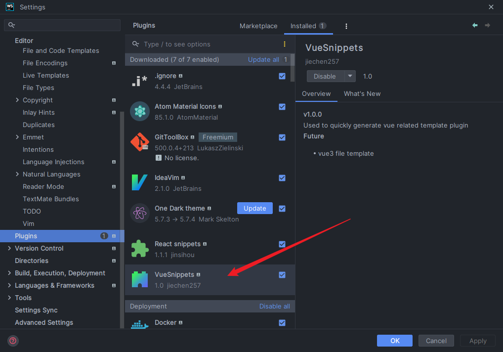

## 介绍
一个 vue 的 snippets 插件，用于 webstorm 等 jetbrains 系的 IDE

## 使用
已自动注入vue文件的context中，输入`vue3`即可对应 vue3 template 补全

具体template结构参考：settings -> live templates -> VueCustom

## 问题记录
### gradle构建失败
`Failed to apply plugin : getHeaderField("Location") must not be null`

网络问题：因为使用的是离线版gradle，断开代理或者切换节点即可

### 打包
gradle环境下：
- 选择右侧 Gradle > Tasks > build > jar，项目根目录会有一个 build 目录生成，里面有一个 libs 子目录可以看到一个 jar 文件
- 在 IntelliJ IDEA 项目里面可能会看不到，被隐藏了，需要打开电脑文件管理器查看这个目录

## RoadMap
1. 补全基本的 `vue template`
2. 形成自己的 `ide template style` 并发布

## 参考
- [IDEA-plugin-template-support](https://plugins.jetbrains.com/docs/intellij/template-support.html#implement-templatecontexttype)

- [Third Party Tutorial](https://github.com/judasn/IntelliJ-IDEA-Tutorial/blob/master/plugins-develop.md)

- [ReactSnippets](https://github.com/jinsihou19/ReactSnippets)
